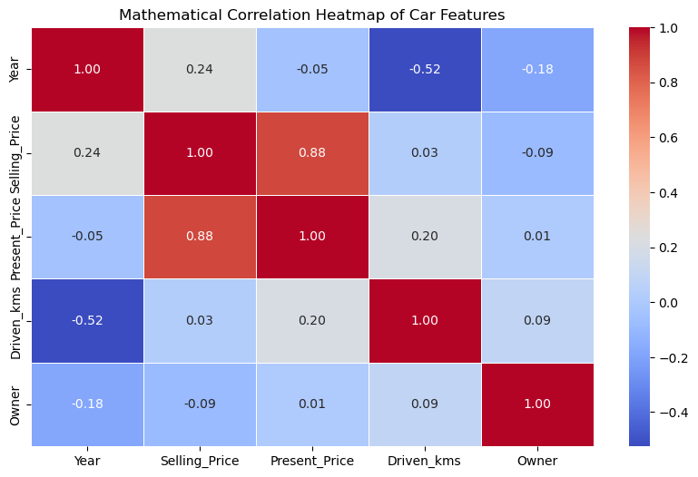
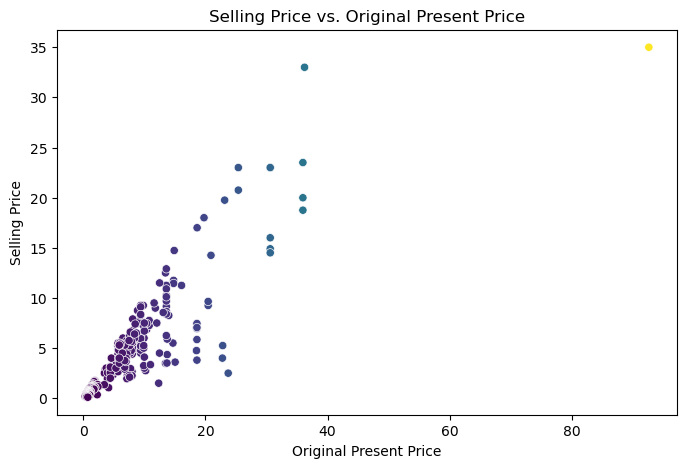
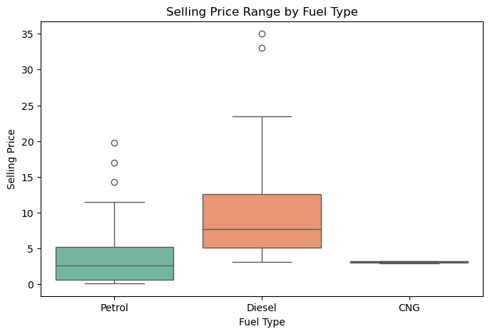

# 🚗 Task 3: Car Price Prediction 

## 📌 Project Goal
The goal of this project is to build a "smart" computer model that can accurately guess the selling price of a used car. We taught the model how to do this by feeding it historical data about car ages, mileage, fuel types, and original showroom prices.

---

## 📊 What Actually Drives a Car's Value?
Before asking the computer to predict prices, we visually explored the data to understand what makes a car expensive or cheap on the used market. Here is what we found:

### 1. The Biggest Clue: The Original Price
We created a mathematical heatmap to see which features are most connected to the final price. 
* **Key Finding:** The original showroom price (`Present_Price`) is the absolute strongest predictor of a car's used price. If it was an expensive car brand new, it will hold a higher value later.
* Additionally, newer cars hold their value well, while higher mileage slowly drops the price.

### 2. Value Over Time (Depreciation)
By putting the original price and the used selling price on the same graph, we can clearly see a trend line. Premium, high-end cars keep a lot more of their raw dollar value compared to budget-friendly cars.

### 3. Fuel and Transmission Matter
When we separated the cars by category, we saw a clear pattern. **Diesel** engines and **Automatic** transmissions usually sell for significantly more money than standard petrol or manual cars.

---

## ⚙️ How We Built the Smart Model

### Preparing the Data for the Computer
Computers only understand numbers, so we had to clean up our spreadsheet before training the model:
* **Cleaning Text:** We converted text categories (like "Petrol" or "Automatic") into 1s and 0s so the math could work.
* **Removing Noise:** We removed the specific `Car_Name` column. There were too many unique names, and we wanted the model to focus on the *physical condition* of the car rather than just memorizing brand names.

### The Results
We tested a **Linear Regression** model (a mathematical algorithm used to predict numbers). 

* **Accuracy Score:** **83.6%**
* **Conclusion:** Our model is highly accurate! It successfully explains 83.6% of the reasons why used car prices go up or down in the real world.

---

## 🌍 How is this useful in the real world?
This isn't just a math experiment; this exact logic is used by massive businesses every day:
1. **Used Car Dealerships:** Websites like CarMax or Carvana use models exactly like this to look at your car's mileage and age to instantly offer you a fair cash price.
2. **Insurance Payouts:** If you get into an accident and your car is totaled, insurance companies use prediction algorithms to figure out exactly how much a replacement car is worth in today's market.
3. **Everyday Buyers:** Tools like Kelley Blue Book (KBB) use this kind of data to help normal people know if they are getting a good deal or getting ripped off when buying a used car.