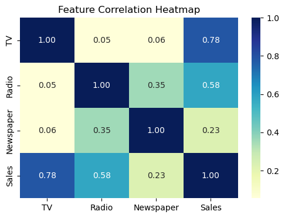
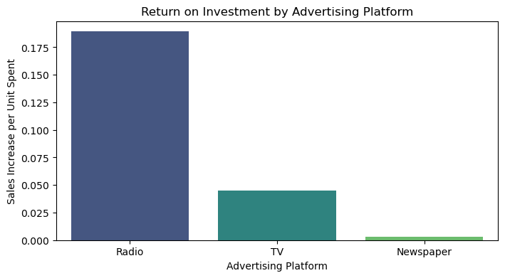

# 📈 Task 4: Sales Prediction & Marketing ROI Analysis

## 📌 Project Objective
The goal of this project is to build a Machine Learning regression model that forecasts corporate sales based on advertising budgets, ultimately delivering actionable reallocation strategies to a marketing team.

**Data Source:** [Kaggle - Advertising Sales Dataset](https://www.kaggle.com/datasets/bumba5341/advertisingcsv)

---

## 🎯 Fulfilling the Project Requirements

### 1. Data Preparation & Feature Selection
The raw `Advertising.csv` dataset was cleaned, and the noisy, non-predictive `Unnamed: 0` index column was dropped to ensure strict feature selection, leaving only `TV`, `Radio`, and `Newspaper` as our predictive matrices.

### 2. Analyze Advertising Impact
Visual Exploratory Data Analysis (EDA) was conducted to measure the impact of changes in advertising on sales outcomes. The correlation heatmap proves that TV advertising has the strongest baseline relationship (0.78) with total sales volume.

### 3. Regression Modeling for Forecasting
A **Multiple Linear Regression** algorithm was trained on 80% of the historical sales data. 
* **Model Accuracy ($R^2$ Score):** **0.899**
* **Conclusion:** The model is exceptionally accurate, successfully forecasting and explaining roughly **90%** of the variance in actual sales.

---

## 💡 Actionable Insights for Business Strategy
By extracting the mathematical coefficients from the machine learning model, we can definitively measure the Return on Investment (ROI) of each advertising platform. 

**The Data-Driven Marketing Strategy:**
1. **Prioritize Radio:** Radio yields the highest incremental return per dollar spent. It is the most cost-efficient platform for scaling sales.
2. **Maintain TV:** TV acts as the reliable anchor for overall sales volume. 
3. **Divest from Newspaper:** Newspaper spending has a near-zero impact on the target variable. **Actionable Insight:** Reallocate 100% of the Newspaper budget into Radio to instantly maximize overall corporate revenue without increasing total marketing spend.

---

## 💻 Tools Used
* **Python**
* **Scikit-Learn** (Machine Learning, Regression Modeling)
* **Pandas & NumPy** (Feature Selection & Data Cleaning)
* **Seaborn & Matplotlib** (Data Visualization)

## 🚀 How to Run My Code
1. Ensure your `Advertising.csv` is located in the `dataset/` folder.
2. Open your terminal and install the required libraries: `pip install -r requirements.txt`
3. Open the Jupyter Notebook and click **Restart & Run All**.