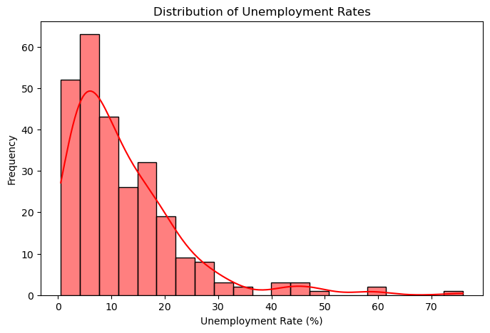
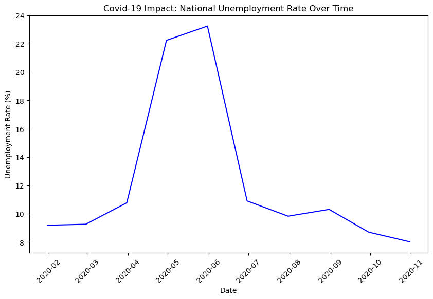
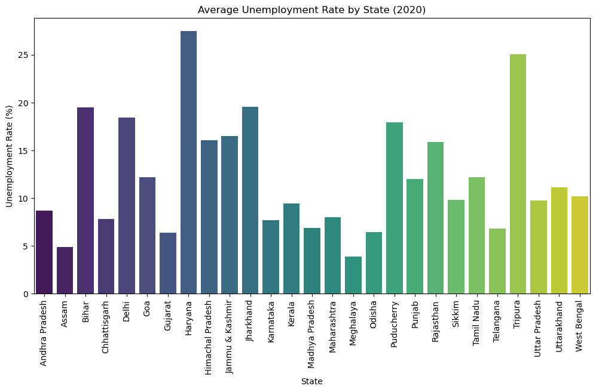
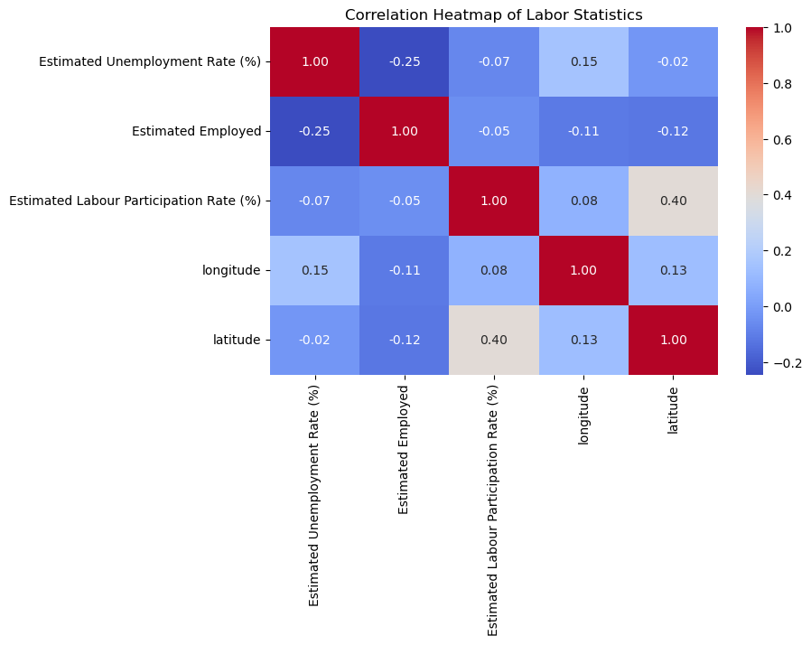

# 📉 Task 2: Unemployment Analysis in India (Covid-19 Impact)

## 📌 Project Overview
This exploratory data analysis (EDA) project examines how the strict Covid-19 lockdowns of 2020 impacted the Indian job market. 

**Data Source:** [Kaggle - Unemployment in India Dataset](https://www.kaggle.com/datasets/gokulrajkmv/unemployment-in-india)

---

## 🛠️ What I Did in This Project
* **Data Cleaning:** Handled missing values and standardized date formats to ensure accurate statistical analysis and visualization.
* **Data Visualization:** Generated time-series charts to clearly illustrate trends, specifically highlighting the precise month the unemployment rate spiked.
* **Feature Engineering:** Created a new "Severity" metric to easily categorize regions with "High" or "Low" unemployment compared to the national baseline.
* **Before vs. After Analysis:** Quantified the exact economic shock by comparing pandemic-era data to pre-covid baselines.

## 📊 Visualization Highlights
Here are the key patterns found during the analysis:

**1. Distribution of Unemployment Rates**

**2. Covid-19 Impact Trend**

**3. Average Unemployment by State**

**4. Correlation Heatmap**

---

## 🏆 Final Conclusion
While the overall yearly average for 2020 only showed a moderate increase, the time-series analysis reveals the true economic story. There was a massive, sudden shock during the strict lockdown months, causing the unemployment rate in the worst-hit states to temporarily spike to an unprecedented **75.85%**.

## 💻 Tools Used
* **Python**
* **Pandas & NumPy** (Data manipulation and statistical analysis)
* **Matplotlib & Seaborn** (Data visualization)
* **Jupyter Notebook**

## 🚀 How to Run My Code
1. Clone this repository to your local machine.
2. Open your terminal and install the required libraries: `pip install -r requirements.txt`
3. Open `Unemployment_Analysis.ipynb` in Jupyter Notebook and click **Restart & Run All**.
